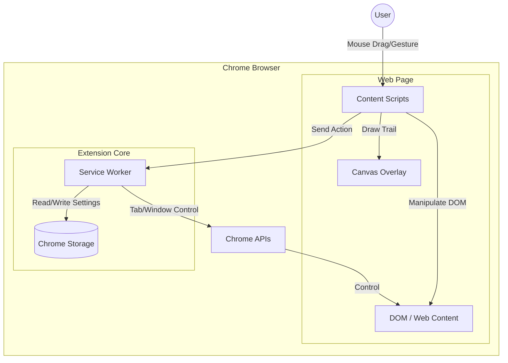

# 02. システム構成図

## 1. アーキテクチャ概要
本システムは、Google Chrome Extensions Manifest V3 に準拠した構成をとる。
主にWebページ上でユーザー操作を検知・描画する **Content Scripts** と、バックグラウンドでブラウザAPIを利用した処理を行う **Service Worker (Background Service)** で構成される。

## 2. コンポーネント構成

## 3. コンポーネント詳細

| コンポーネント | 役割 | 主な責務 |
| :--- | :--- | :--- |
| **Content Scripts** | ユーザーインターフェース、イベント検知 | ・マウスイベント（mousedown, mousemove, mouseup, contextmenu）の監視 ・ジェスチャ軌跡（トレイル）の描画 ・アクション名オーバーレイの表示 ・DOM操作を伴うアクション（スクロール、ズーム等）の実行判定 ・Service Workerへのメッセージ送信 |
| **Service Worker** | バックグラウンド処理、API連携 | ・タブ操作（新規作成、閉じる、切替） ・ウィンドウ操作 ・検索実行（検索URL生成とタブオープン） ・設定データの読み込み・提供 ・Content Scriptsからのメッセージ受信と処理実行 |
| **Chrome Storage** | 設定保存 | ・ジェスチャ定義、アクション定義、設定値の永続化 ・将来的な設定変更に対応可能なJSON形式での保存 |

## 4. 技術スタック
*   **言語**: TypeScript (HTML/CSS含む)
*   **フレームワーク**: なし (Vanilla JS/TS)
*   **ビルドツール**: Vite
*   **プラットフォーム**: Chrome Extension Manifest V3
